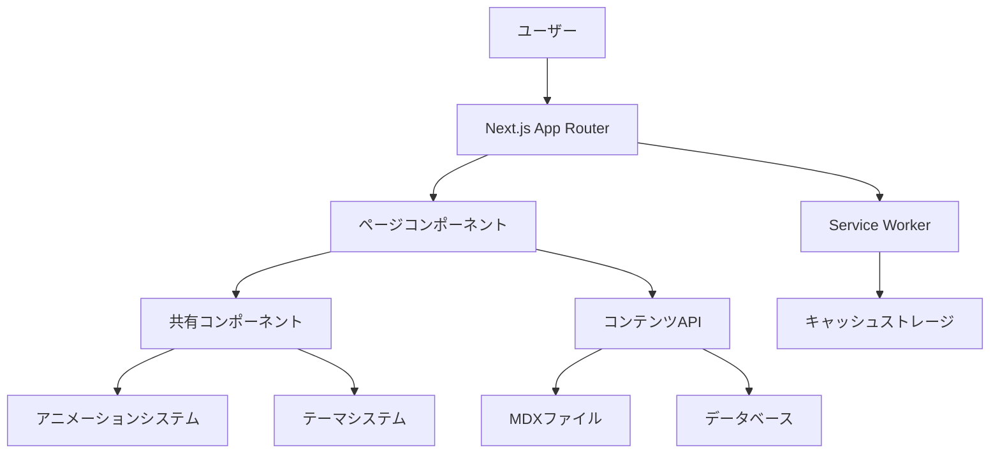

# 設計文書

## 概要

限界を超えたスタイリッシュでクールなモノトーン基調のブログサイトは、最新のWeb技術を活用して構築されます。React/Next.jsをベースとし、TypeScriptで型安全性を確保し、TailwindCSSとFramer Motionを使用して洗練されたモノトーンデザインと滑らかなアニメーションを実現します。

### 主要技術スタック
- **フロントエンド**: Next.js 14 (App Router), React 18, TypeScript
- **スタイリング**: TailwindCSS, CSS Modules, CSS Custom Properties
- **アニメーション**: Framer Motion, CSS Transforms
- **コンテンツ管理**: MDX (Markdown + JSX), Gray-matter
- **データベース**: SQLite (開発), PostgreSQL (本番)
- **検索**: Fuse.js (クライアントサイド), Algolia (オプション)
- **PWA**: Next-PWA, Service Workers
- **分析**: Vercel Analytics, Web Vitals

## アーキテクチャ

### システム構成



### ディレクトリ構造

```
src/
├── app/                    # Next.js App Router
│   ├── (blog)/            # ブログルートグループ
│   │   ├── page.tsx       # ホームページ
│   │   ├── [slug]/        # 記事詳細ページ
│   │   ├── category/      # カテゴリページ
│   │   └── archive/       # アーカイブページ
│   ├── api/               # APIルート
│   ├── globals.css        # グローバルスタイル
│   └── layout.tsx         # ルートレイアウト
├── components/            # 再利用可能コンポーネント
│   ├── ui/               # 基本UIコンポーネント
│   ├── blog/             # ブログ特有コンポーネント
│   ├── animations/       # アニメーションコンポーネント
│   └── layout/           # レイアウトコンポーネント
├── lib/                  # ユーティリティとヘルパー
│   ├── content.ts        # コンテンツ管理
│   ├── animations.ts     # アニメーション設定
│   └── theme.ts          # テーマ管理
├── styles/               # スタイル関連
├── types/                # TypeScript型定義
└── content/              # MDXコンテンツファイル
    ├── posts/            # ブログ記事
    └── authors/          # 著者情報
```

## コンポーネントとインターフェース

### 核となるコンポーネント

#### 1. レイアウトコンポーネント

**Header Component**
```typescript
interface HeaderProps {
  theme: 'light' | 'dark';
  onThemeToggle: () => void;
  isScrolled: boolean;
}

const Header: React.FC<HeaderProps> = ({ theme, onThemeToggle, isScrolled }) => {
  // ナビゲーション、テーマトグル、検索機能
  // スクロール時の背景ブラー効果
  // モバイル対応ハンバーガーメニュー
};
```

**Footer Component**
```typescript
interface FooterProps {
  newsletter: boolean;
  socialLinks: SocialLink[];
}

const Footer: React.FC<FooterProps> = ({ newsletter, socialLinks }) => {
  // ニュースレター購読フォーム
  // ソーシャルリンク
  // サイトマップ
};
```

#### 2. ブログコンポーネント

**ArticleCard Component**
```typescript
interface ArticleCardProps {
  article: Article;
  variant: 'featured' | 'grid' | 'list';
  showAuthor?: boolean;
  showReadTime?: boolean;
}

const ArticleCard: React.FC<ArticleCardProps> = ({ 
  article, 
  variant, 
  showAuthor = true, 
  showReadTime = true 
}) => {
  // ホバーアニメーション
  // 読書時間表示
  // カテゴリタグ
  // 著者情報
};
```

**ArticleContent Component**
```typescript
interface ArticleContentProps {
  content: string;
  tableOfContents: TOCItem[];
  readingProgress: number;
}

const ArticleContent: React.FC<ArticleContentProps> = ({ 
  content, 
  tableOfContents, 
  readingProgress 
}) => {
  // MDXレンダリング
  // 読書進捗バー
  // 目次ナビゲーション
  // コードハイライト
};
```

#### 3. インタラクティブコンポーネント

**SearchComponent**
```typescript
interface SearchProps {
  onSearch: (query: string) => void;
  results: SearchResult[];
  isLoading: boolean;
}

const SearchComponent: React.FC<SearchProps> = ({ 
  onSearch, 
  results, 
  isLoading 
}) => {
  // リアルタイム検索
  // オートコンプリート
  // 検索結果ハイライト
  // キーボードナビゲーション
};
```

**CommentSystem Component**
```typescript
interface CommentSystemProps {
  articleId: string;
  comments: Comment[];
  onSubmit: (comment: NewComment) => void;
}

const CommentSystem: React.FC<CommentSystemProps> = ({ 
  articleId, 
  comments, 
  onSubmit 
}) => {
  // ネストしたコメント
  // 返信機能
  // スパム防止
  // モデレーション
};
```

### アニメーションシステム

#### Framer Motion設定

```typescript
// lib/animations.ts
export const pageTransitions = {
  initial: { opacity: 0, y: 20 },
  animate: { opacity: 1, y: 0 },
  exit: { opacity: 0, y: -20 },
  transition: { duration: 0.3, ease: "easeInOut" }
};

export const staggerContainer = {
  animate: {
    transition: {
      staggerChildren: 0.1
    }
  }
};

export const fadeInUp = {
  initial: { opacity: 0, y: 30 },
  animate: { opacity: 1, y: 0 },
  transition: { duration: 0.6, ease: "easeOut" }
};

export const parallaxScroll = {
  y: [0, -50],
  transition: { duration: 2, repeat: Infinity, repeatType: "reverse" }
};
```

#### カスタムフック

```typescript
// hooks/useScrollAnimation.ts
export const useScrollAnimation = () => {
  const [scrollY, setScrollY] = useState(0);
  const [isVisible, setIsVisible] = useState(false);
  
  useEffect(() => {
    const handleScroll = () => setScrollY(window.scrollY);
    window.addEventListener('scroll', handleScroll);
    return () => window.removeEventListener('scroll', handleScroll);
  }, []);
  
  return { scrollY, isVisible };
};
```

## データモデル

### 記事データモデル

```typescript
interface Article {
  id: string;
  slug: string;
  title: string;
  excerpt: string;
  content: string;
  publishedAt: Date;
  updatedAt: Date;
  author: Author;
  categories: Category[];
  tags: Tag[];
  featuredImage?: string;
  readingTime: number;
  isPublished: boolean;
  seo: SEOMetadata;
}

interface Author {
  id: string;
  name: string;
  bio: string;
  avatar: string;
  socialLinks: SocialLink[];
  articlesCount: number;
}

interface Category {
  id: string;
  name: string;
  slug: string;
  description: string;
  color: string; // モノトーン範囲内
  articlesCount: number;
  parentId?: string; // 階層カテゴリサポート
  children?: Category[];
  isActive: boolean;
}

interface Tag {
  id: string;
  name: string;
  slug: string;
  description?: string;
  articlesCount: number;
  isActive: boolean;
}

interface SEOMetadata {
  metaTitle: string;
  metaDescription: string;
  ogImage: string;
  keywords: string[];
  structuredData: object;
}
```

### コンテンツ管理システム

```typescript
// lib/content.ts
export class ContentManager {
  static async getAllArticles(): Promise<Article[]> {
    // MDXファイルの読み込み
    // フロントマターの解析
    // 読書時間の計算
  }
  
  static async getArticleBySlug(slug: string): Promise<Article | null> {
    // 特定記事の取得
    // 関連記事の計算
    // 目次の生成
  }
  
  static async searchArticles(query: string): Promise<SearchResult[]> {
    // Fuse.jsを使用した検索
    // 結果のハイライト
    // 関連度スコア
  }
}
```

## テーマシステム

### モノトーンカラーパレット

```css
/* styles/colors.css */
:root {
  /* ライトテーマ */
  --color-primary: #000000;
  --color-secondary: #333333;
  --color-tertiary: #666666;
  --color-quaternary: #999999;
  --color-background: #ffffff;
  --color-surface: #f8f9fa;
  --color-border: #e9ecef;
  
  /* グラデーション */
  --gradient-primary: linear-gradient(135deg, #000000 0%, #333333 100%);
  --gradient-secondary: linear-gradient(135deg, #666666 0%, #999999 100%);
  
  /* シャドウ */
  --shadow-sm: 0 1px 2px rgba(0, 0, 0, 0.05);
  --shadow-md: 0 4px 6px rgba(0, 0, 0, 0.1);
  --shadow-lg: 0 10px 15px rgba(0, 0, 0, 0.1);
  --shadow-xl: 0 20px 25px rgba(0, 0, 0, 0.15);
}

[data-theme="dark"] {
  --color-primary: #ffffff;
  --color-secondary: #cccccc;
  --color-tertiary: #999999;
  --color-quaternary: #666666;
  --color-background: #000000;
  --color-surface: #111111;
  --color-border: #333333;
}
```

### TailwindCSS設定

```javascript
// tailwind.config.js
module.exports = {
  content: ['./src/**/*.{js,ts,jsx,tsx,mdx}'],
  darkMode: ['class', '[data-theme="dark"]'],
  theme: {
    extend: {
      colors: {
        primary: 'var(--color-primary)',
        secondary: 'var(--color-secondary)',
        tertiary: 'var(--color-tertiary)',
        quaternary: 'var(--color-quaternary)',
        background: 'var(--color-background)',
        surface: 'var(--color-surface)',
        border: 'var(--color-border)',
      },
      fontFamily: {
        sans: ['Inter', 'system-ui', 'sans-serif'],
        serif: ['Playfair Display', 'Georgia', 'serif'],
        mono: ['JetBrains Mono', 'Menlo', 'monospace'],
      },
      animation: {
        'fade-in': 'fadeIn 0.5s ease-in-out',
        'slide-up': 'slideUp 0.3s ease-out',
        'parallax': 'parallax 20s linear infinite',
      },
    },
  },
  plugins: [
    require('@tailwindcss/typography'),
    require('@tailwindcss/forms'),
  ],
};
```## エラーハンドリン
グ

### エラー境界とフォールバック

```typescript
// components/ErrorBoundary.tsx
interface ErrorBoundaryState {
  hasError: boolean;
  error?: Error;
}

class ErrorBoundary extends React.Component<
  React.PropsWithChildren<{}>,
  ErrorBoundaryState
> {
  constructor(props: React.PropsWithChildren<{}>) {
    super(props);
    this.state = { hasError: false };
  }

  static getDerivedStateFromError(error: Error): ErrorBoundaryState {
    return { hasError: true, error };
  }

  componentDidCatch(error: Error, errorInfo: React.ErrorInfo) {
    console.error('Error caught by boundary:', error, errorInfo);
    // エラー報告サービスに送信
  }

  render() {
    if (this.state.hasError) {
      return (
        <div className="min-h-screen flex items-center justify-center bg-background">
          <div className="text-center">
            <h1 className="text-2xl font-bold text-primary mb-4">
              エラーが発生しました
            </h1>
            <p className="text-secondary mb-6">
              ページの読み込み中に問題が発生しました
            </p>
            <button
              onClick={() => window.location.reload()}
              className="px-6 py-2 bg-primary text-background rounded-lg hover:opacity-80 transition-opacity"
            >
              ページを再読み込み
            </button>
          </div>
        </div>
      );
    }

    return this.props.children;
  }
}
```

### APIエラーハンドリング

```typescript
// lib/api-client.ts
export class APIError extends Error {
  constructor(
    message: string,
    public status: number,
    public code?: string
  ) {
    super(message);
    this.name = 'APIError';
  }
}

export const apiClient = {
  async get<T>(url: string): Promise<T> {
    try {
      const response = await fetch(url);
      if (!response.ok) {
        throw new APIError(
          `HTTP ${response.status}: ${response.statusText}`,
          response.status
        );
      }
      return await response.json();
    } catch (error) {
      if (error instanceof APIError) throw error;
      throw new APIError('ネットワークエラーが発生しました', 0);
    }
  }
};
```

### 404とフォールバックページ

```typescript
// app/not-found.tsx
export default function NotFound() {
  return (
    <div className="min-h-screen flex items-center justify-center bg-background">
      <div className="text-center">
        <h1 className="text-6xl font-bold text-primary mb-4">404</h1>
        <p className="text-xl text-secondary mb-8">
          お探しのページが見つかりません
        </p>
        <Link
          href="/"
          className="inline-block px-6 py-3 bg-primary text-background rounded-lg hover:opacity-80 transition-opacity"
        >
          ホームに戻る
        </Link>
      </div>
    </div>
  );
}
```

## テスト戦略

### テスト構成

```typescript
// __tests__/setup.ts
import '@testing-library/jest-dom';
import { configure } from '@testing-library/react';

configure({ testIdAttribute: 'data-testid' });

// モックの設定
jest.mock('next/navigation', () => ({
  useRouter: () => ({
    push: jest.fn(),
    replace: jest.fn(),
    back: jest.fn(),
  }),
  usePathname: () => '/',
  useSearchParams: () => new URLSearchParams(),
}));
```

### コンポーネントテスト

```typescript
// __tests__/components/ArticleCard.test.tsx
import { render, screen, fireEvent } from '@testing-library/react';
import { ArticleCard } from '@/components/blog/ArticleCard';

const mockArticle = {
  id: '1',
  title: 'テスト記事',
  excerpt: 'テスト記事の概要',
  slug: 'test-article',
  publishedAt: new Date('2024-01-01'),
  author: { name: 'テスト著者', avatar: '/avatar.jpg' },
  readingTime: 5,
  categories: [{ name: 'テクノロジー', slug: 'tech' }],
};

describe('ArticleCard', () => {
  it('記事情報を正しく表示する', () => {
    render(<ArticleCard article={mockArticle} variant="grid" />);
    
    expect(screen.getByText('テスト記事')).toBeInTheDocument();
    expect(screen.getByText('テスト記事の概要')).toBeInTheDocument();
    expect(screen.getByText('テスト著者')).toBeInTheDocument();
    expect(screen.getByText('5分で読める')).toBeInTheDocument();
  });

  it('ホバー時にアニメーションが動作する', () => {
    render(<ArticleCard article={mockArticle} variant="grid" />);
    
    const card = screen.getByTestId('article-card');
    fireEvent.mouseEnter(card);
    
    expect(card).toHaveClass('transform', 'scale-105');
  });
});
```

### E2Eテスト

```typescript
// e2e/blog-navigation.spec.ts
import { test, expect } from '@playwright/test';

test.describe('ブログナビゲーション', () => {
  test('ホームページから記事詳細への遷移', async ({ page }) => {
    await page.goto('/');
    
    // 最初の記事カードをクリック
    await page.click('[data-testid="article-card"]:first-child');
    
    // 記事詳細ページに遷移することを確認
    await expect(page).toHaveURL(/\/blog\/.+/);
    await expect(page.locator('h1')).toBeVisible();
    await expect(page.locator('[data-testid="reading-progress"]')).toBeVisible();
  });

  test('検索機能の動作', async ({ page }) => {
    await page.goto('/');
    
    // 検索ボックスに入力
    await page.fill('[data-testid="search-input"]', 'React');
    
    // 検索結果が表示されることを確認
    await expect(page.locator('[data-testid="search-results"]')).toBeVisible();
    await expect(page.locator('[data-testid="search-result-item"]')).toHaveCount.greaterThan(0);
  });
});
```

## パフォーマンス最適化

### 画像最適化

```typescript
// components/OptimizedImage.tsx
import Image from 'next/image';
import { useState } from 'react';

interface OptimizedImageProps {
  src: string;
  alt: string;
  width: number;
  height: number;
  priority?: boolean;
  className?: string;
}

export const OptimizedImage: React.FC<OptimizedImageProps> = ({
  src,
  alt,
  width,
  height,
  priority = false,
  className = '',
}) => {
  const [isLoading, setIsLoading] = useState(true);

  return (
    <div className={`relative overflow-hidden ${className}`}>
      {isLoading && (
        <div className="absolute inset-0 bg-surface animate-pulse" />
      )}
      <Image
        src={src}
        alt={alt}
        width={width}
        height={height}
        priority={priority}
        className={`transition-opacity duration-300 ${
          isLoading ? 'opacity-0' : 'opacity-100'
        }`}
        onLoadingComplete={() => setIsLoading(false)}
        sizes="(max-width: 768px) 100vw, (max-width: 1200px) 50vw, 33vw"
      />
    </div>
  );
};
```

### コード分割とレイジーローディング

```typescript
// 動的インポートによるコード分割
const CommentSystem = dynamic(
  () => import('@/components/blog/CommentSystem'),
  {
    loading: () => <CommentSystemSkeleton />,
    ssr: false,
  }
);

const SearchModal = dynamic(
  () => import('@/components/search/SearchModal'),
  {
    loading: () => <div>検索を読み込み中...</div>,
  }
);
```

### Service Worker設定

```typescript
// public/sw.js
const CACHE_NAME = 'monochrome-blog-v1';
const urlsToCache = [
  '/',
  '/static/css/main.css',
  '/static/js/main.js',
  '/offline',
];

self.addEventListener('install', (event) => {
  event.waitUntil(
    caches.open(CACHE_NAME)
      .then((cache) => cache.addAll(urlsToCache))
  );
});

self.addEventListener('fetch', (event) => {
  event.respondWith(
    caches.match(event.request)
      .then((response) => {
        if (response) {
          return response;
        }
        return fetch(event.request);
      })
      .catch(() => {
        if (event.request.destination === 'document') {
          return caches.match('/offline');
        }
      })
  );
});
```

## SEOとアクセシビリティ

### メタデータ生成

```typescript
// app/blog/[slug]/page.tsx
export async function generateMetadata({ params }: { params: { slug: string } }) {
  const article = await getArticleBySlug(params.slug);
  
  if (!article) {
    return {
      title: '記事が見つかりません',
    };
  }

  return {
    title: article.seo.metaTitle || article.title,
    description: article.seo.metaDescription || article.excerpt,
    keywords: article.seo.keywords,
    openGraph: {
      title: article.title,
      description: article.excerpt,
      images: [article.seo.ogImage],
      type: 'article',
      publishedTime: article.publishedAt.toISOString(),
      authors: [article.author.name],
    },
    twitter: {
      card: 'summary_large_image',
      title: article.title,
      description: article.excerpt,
      images: [article.seo.ogImage],
    },
  };
}
```

### 構造化データ

```typescript
// lib/structured-data.ts
export const generateArticleStructuredData = (article: Article) => {
  return {
    '@context': 'https://schema.org',
    '@type': 'BlogPosting',
    headline: article.title,
    description: article.excerpt,
    image: article.featuredImage,
    author: {
      '@type': 'Person',
      name: article.author.name,
    },
    publisher: {
      '@type': 'Organization',
      name: 'モノトーンブログ',
    },
    datePublished: article.publishedAt.toISOString(),
    dateModified: article.updatedAt.toISOString(),
    mainEntityOfPage: {
      '@type': 'WebPage',
      '@id': `https://example.com/blog/${article.slug}`,
    },
  };
};
```

### アクセシビリティ機能

```typescript
// hooks/useKeyboardNavigation.ts
export const useKeyboardNavigation = () => {
  useEffect(() => {
    const handleKeyDown = (event: KeyboardEvent) => {
      // Escキーでモーダルを閉じる
      if (event.key === 'Escape') {
        // モーダル閉じる処理
      }
      
      // Ctrl+Kで検索を開く
      if (event.ctrlKey && event.key === 'k') {
        event.preventDefault();
        // 検索モーダルを開く処理
      }
    };

    document.addEventListener('keydown', handleKeyDown);
    return () => document.removeEventListener('keydown', handleKeyDown);
  }, []);
};
```

## デプロイメントと運用

### Vercel設定

```json
// vercel.json
{
  "buildCommand": "npm run build",
  "outputDirectory": ".next",
  "framework": "nextjs",
  "functions": {
    "app/api/**/*.ts": {
      "maxDuration": 10
    }
  },
  "headers": [
    {
      "source": "/(.*)",
      "headers": [
        {
          "key": "X-Content-Type-Options",
          "value": "nosniff"
        },
        {
          "key": "X-Frame-Options",
          "value": "DENY"
        },
        {
          "key": "X-XSS-Protection",
          "value": "1; mode=block"
        }
      ]
    }
  ]
}
```

### 環境変数設定

```bash
# .env.local
NEXT_PUBLIC_SITE_URL=https://monochrome-blog.vercel.app
NEXT_PUBLIC_ANALYTICS_ID=your-analytics-id
DATABASE_URL=your-database-url
NEXTAUTH_SECRET=your-nextauth-secret
NEXTAUTH_URL=https://monochrome-blog.vercel.app
```

この設計により、要件で定義されたすべての機能を技術的に実現し、真に「限界を超えた」モノトーンブログサイトを構築できます。

## カテゴリとタグシステムの詳細設計

### カテゴリ・タグ管理コンポーネント

```typescript
// components/blog/CategoryFilter.tsx
interface CategoryFilterProps {
  categories: Category[];
  selectedCategory?: string;
  onCategorySelect: (categorySlug: string | null) => void;
  showHierarchy?: boolean;
}

const CategoryFilter: React.FC<CategoryFilterProps> = ({
  categories,
  selectedCategory,
  onCategorySelect,
  showHierarchy = true
}) => {
  const renderCategoryTree = (categories: Category[], level = 0) => {
    return categories.map(category => (
      <div key={category.id} className={`ml-${level * 4}`}>
        <button
          onClick={() => onCategorySelect(category.slug)}
          className={`flex items-center space-x-2 p-2 rounded-lg transition-colors ${
            selectedCategory === category.slug
              ? 'bg-primary text-background'
              : 'hover:bg-surface'
          }`}
        >
          <span className="text-sm font-medium">{category.name}</span>
          <span className="text-xs text-tertiary">({category.articlesCount})</span>
        </button>
        {showHierarchy && category.children && (
          <div className="mt-1">
            {renderCategoryTree(category.children, level + 1)}
          </div>
        )}
      </div>
    ));
  };

  return (
    <div className="space-y-2">
      <h3 className="text-lg font-semibold text-primary mb-4">カテゴリ</h3>
      <button
        onClick={() => onCategorySelect(null)}
        className={`w-full text-left p-2 rounded-lg transition-colors ${
          !selectedCategory
            ? 'bg-primary text-background'
            : 'hover:bg-surface'
        }`}
      >
        すべて
      </button>
      {renderCategoryTree(categories)}
    </div>
  );
};
```

```typescript
// components/blog/TagCloud.tsx
interface TagCloudProps {
  tags: Tag[];
  selectedTags: string[];
  onTagToggle: (tagSlug: string) => void;
  maxTags?: number;
}

const TagCloud: React.FC<TagCloudProps> = ({
  tags,
  selectedTags,
  onTagToggle,
  maxTags = 50
}) => {
  const sortedTags = tags
    .sort((a, b) => b.articlesCount - a.articlesCount)
    .slice(0, maxTags);

  const getTagSize = (count: number) => {
    const maxCount = Math.max(...tags.map(t => t.articlesCount));
    const minCount = Math.min(...tags.map(t => t.articlesCount));
    const ratio = (count - minCount) / (maxCount - minCount);
    return `${0.8 + ratio * 0.6}rem`; // 0.8rem to 1.4rem
  };

  return (
    <div className="space-y-4">
      <h3 className="text-lg font-semibold text-primary">タグ</h3>
      <div className="flex flex-wrap gap-2">
        {sortedTags.map(tag => (
          <button
            key={tag.id}
            onClick={() => onTagToggle(tag.slug)}
            className={`px-3 py-1 rounded-full text-sm transition-all duration-200 ${
              selectedTags.includes(tag.slug)
                ? 'bg-primary text-background'
                : 'bg-surface text-secondary hover:bg-border'
            }`}
            style={{ fontSize: getTagSize(tag.articlesCount) }}
          >
            #{tag.name}
            <span className="ml-1 text-xs opacity-70">
              ({tag.articlesCount})
            </span>
          </button>
        ))}
      </div>
    </div>
  );
};
```

### カテゴリ・タグページコンポーネント

```typescript
// app/category/[slug]/page.tsx
interface CategoryPageProps {
  params: { slug: string };
  searchParams: { page?: string; tag?: string };
}

export default async function CategoryPage({ 
  params, 
  searchParams 
}: CategoryPageProps) {
  const category = await getCategoryBySlug(params.slug);
  const selectedTags = searchParams.tag?.split(',') || [];
  const currentPage = parseInt(searchParams.page || '1');
  
  if (!category) {
    notFound();
  }

  const articles = await getArticlesByCategory(
    category.slug,
    selectedTags,
    currentPage
  );

  return (
    <div className="container mx-auto px-4 py-8">
      <div className="mb-8">
        <h1 className="text-4xl font-bold text-primary mb-4">
          {category.name}
        </h1>
        <p className="text-lg text-secondary mb-6">
          {category.description}
        </p>
        <div className="flex items-center space-x-4 text-sm text-tertiary">
          <span>{category.articlesCount} 記事</span>
          {category.parentId && (
            <Link 
              href={`/category/${category.parent?.slug}`}
              className="hover:text-primary transition-colors"
            >
              ← {category.parent?.name}
            </Link>
          )}
        </div>
      </div>

      <div className="grid grid-cols-1 lg:grid-cols-4 gap-8">
        <aside className="lg:col-span-1">
          <TagFilter
            tags={await getTagsByCategory(category.slug)}
            selectedTags={selectedTags}
            onTagToggle={(tag) => {
              // URL更新ロジック
            }}
          />
        </aside>

        <main className="lg:col-span-3">
          <ArticleGrid articles={articles} />
          <Pagination
            currentPage={currentPage}
            totalPages={Math.ceil(articles.total / 12)}
            baseUrl={`/category/${category.slug}`}
          />
        </main>
      </div>
    </div>
  );
}
```

### カテゴリ・タグAPI設計

```typescript
// lib/api/categories.ts
export class CategoryAPI {
  static async getAllCategories(): Promise<Category[]> {
    // 階層構造を含むすべてのカテゴリを取得
    const categories = await db.category.findMany({
      where: { isActive: true },
      include: {
        children: true,
        parent: true,
        _count: {
          select: { articles: true }
        }
      },
      orderBy: { name: 'asc' }
    });

    return categories.map(cat => ({
      ...cat,
      articlesCount: cat._count.articles
    }));
  }

  static async getCategoryBySlug(slug: string): Promise<Category | null> {
    const category = await db.category.findUnique({
      where: { slug, isActive: true },
      include: {
        children: true,
        parent: true,
        _count: {
          select: { articles: true }
        }
      }
    });

    if (!category) return null;

    return {
      ...category,
      articlesCount: category._count.articles
    };
  }

  static async getArticlesByCategory(
    categorySlug: string,
    tagSlugs: string[] = [],
    page: number = 1,
    limit: number = 12
  ): Promise<{ articles: Article[]; total: number }> {
    const where = {
      categories: {
        some: { slug: categorySlug }
      },
      isPublished: true,
      ...(tagSlugs.length > 0 && {
        tags: {
          some: {
            slug: { in: tagSlugs }
          }
        }
      })
    };

    const [articles, total] = await Promise.all([
      db.article.findMany({
        where,
        include: {
          author: true,
          categories: true,
          tags: true
        },
        orderBy: { publishedAt: 'desc' },
        skip: (page - 1) * limit,
        take: limit
      }),
      db.article.count({ where })
    ]);

    return { articles, total };
  }
}
```

```typescript
// lib/api/tags.ts
export class TagAPI {
  static async getAllTags(): Promise<Tag[]> {
    const tags = await db.tag.findMany({
      where: { isActive: true },
      include: {
        _count: {
          select: { articles: true }
        }
      },
      orderBy: { name: 'asc' }
    });

    return tags.map(tag => ({
      ...tag,
      articlesCount: tag._count.articles
    }));
  }

  static async getTagsByCategory(categorySlug: string): Promise<Tag[]> {
    const tags = await db.tag.findMany({
      where: {
        articles: {
          some: {
            categories: {
              some: { slug: categorySlug }
            }
          }
        },
        isActive: true
      },
      include: {
        _count: {
          select: { articles: true }
        }
      },
      orderBy: { name: 'asc' }
    });

    return tags.map(tag => ({
      ...tag,
      articlesCount: tag._count.articles
    }));
  }

  static async getPopularTags(limit: number = 20): Promise<Tag[]> {
    const tags = await db.tag.findMany({
      where: { isActive: true },
      include: {
        _count: {
          select: { articles: true }
        }
      },
      orderBy: {
        articles: {
          _count: 'desc'
        }
      },
      take: limit
    });

    return tags.map(tag => ({
      ...tag,
      articlesCount: tag._count.articles
    }));
  }
}
```

### カテゴリ・タグナビゲーション

```typescript
// components/blog/CategoryBreadcrumb.tsx
interface CategoryBreadcrumbProps {
  category: Category;
}

const CategoryBreadcrumb: React.FC<CategoryBreadcrumbProps> = ({ category }) => {
  const buildBreadcrumb = (cat: Category): Category[] => {
    const breadcrumb = [cat];
    let current = cat.parent;
    
    while (current) {
      breadcrumb.unshift(current);
      current = current.parent;
    }
    
    return breadcrumb;
  };

  const breadcrumb = buildBreadcrumb(category);

  return (
    <nav className="flex items-center space-x-2 text-sm text-tertiary mb-6">
      <Link href="/" className="hover:text-primary transition-colors">
        ホーム
      </Link>
      <span>/</span>
      <Link href="/categories" className="hover:text-primary transition-colors">
        カテゴリ
      </Link>
      {breadcrumb.map((cat, index) => (
        <React.Fragment key={cat.id}>
          <span>/</span>
          {index === breadcrumb.length - 1 ? (
            <span className="text-primary font-medium">{cat.name}</span>
          ) : (
            <Link
              href={`/category/${cat.slug}`}
              className="hover:text-primary transition-colors"
            >
              {cat.name}
            </Link>
          )}
        </React.Fragment>
      ))}
    </nav>
  );
};
```

### 検索統合

```typescript
// lib/search.ts
export class SearchService {
  static async searchWithFilters(
    query: string,
    categorySlug?: string,
    tagSlugs: string[] = []
  ): Promise<SearchResult[]> {
    const fuse = new Fuse(await getAllArticles(), {
      keys: ['title', 'excerpt', 'content'],
      threshold: 0.3,
      includeScore: true,
      includeMatches: true
    });

    let results = query ? fuse.search(query) : 
      (await getAllArticles()).map(article => ({ item: article, score: 0 }));

    // カテゴリフィルタ
    if (categorySlug) {
      results = results.filter(result =>
        result.item.categories.some(cat => cat.slug === categorySlug)
      );
    }

    // タグフィルタ
    if (tagSlugs.length > 0) {
      results = results.filter(result =>
        tagSlugs.every(tagSlug =>
          result.item.tags.some(tag => tag.slug === tagSlug)
        )
      );
    }

    return results.map(result => ({
      article: result.item,
      score: result.score || 0,
      matches: result.matches || []
    }));
  }
}
```

この詳細設計により、カテゴリとタグ機能が完全に実装され、階層カテゴリ、タグクラウド、フィルタリング、検索統合などの高度な機能を提供できます。